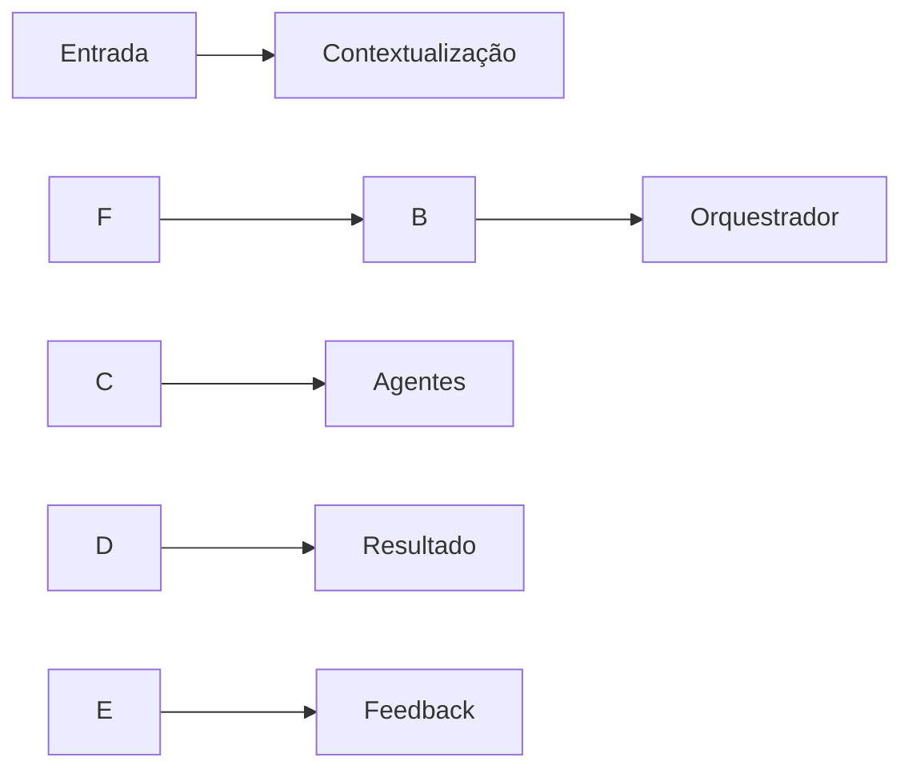

\# 🧠 Intelligent Agent Orchestration + Second Brain


Sistema para \*\*orquestração de agentes inteligentes\*\* com suporte a um \*\*Segundo Cérebro\*\* (base de conhecimento dinâmica), focado em automação de processos de negócio, especialmente em consultoria, contabilidade e serviços profissionais.


\---


\## 🚀 Visão


Autonomia total em IA é uma ilusão.


Este projeto propõe uma abordagem mais robusta:

👉 \*\*múltiplos agentes especializados + um orquestrador + memória persistente\*\*


\---


\## 🎯 Objetivos


\* Reduzir trabalho manual em até 80–95%

\* Aumentar precisão (2–3x)

\* Garantir compliance (RGPD/LGPD)

\* Criar um sistema que \*\*aprende continuamente\*\*


\---


\## 🧩 Arquitetura


\### Componentes principais


\* 🧠 \*\*Orchestrator\*\*


&#x20; \* Coordena fluxo

&#x20; \* Decide quais agentes executar


\* 🔎 \*\*Scorer Agent\*\*


&#x20; \* Qualifica entradas (leads, tarefas)


\* ✍️ \*\*Generator Agent\*\*


&#x20; \* Gera outputs (propostas, relatórios)


\* 🛡️ \*\*Guardian Agent\*\*


&#x20; \* Valida compliance e risco


\* 📚 \*\*Second Brain\*\*


&#x20; \* Base de conhecimento + memória


\---


\## 🔄 Fluxo





\---


\## 🧠 Segundo Cérebro


Estrutura recomendada:


```

/second-brain

&#x20; /clients

&#x20; /processes

&#x20; /rules

&#x20; /templates

&#x20; /history

```


Funções:


\* Memória

\* Contexto

\* Aprendizado contínuo


\---


\## ⚙️ Stack Sugerida


\* Backend: Node.js / Python (FastAPI)

\* LLM: OpenAI / Local (LLM híbrido)

\* Base vetorial: Pinecone / Weaviate / Chroma

\* Orquestração: LangChain / Custom

\* Frontend: HTML + JS (dashboard Kanban)

\* Integrações: CRM, Email, WhatsApp


\---


\## 🧪 Casos de Uso


\### 📊 Consultoria / Contabilidade


\* Qualificação de leads

\* Geração de propostas

\* Validação fiscal


\### 🧾 Automação de Escritório


\* Processamento de documentos

\* Classificação de tarefas

\* Respostas automáticas


\### 💻 Micro-SaaS


\* Atendimento inteligente

\* Motor de decisão

\* Copiloto operacional


\---


\## 🏗️ Estrutura do Projeto


```

/src

&#x20; /agents

&#x20; /orchestrator

&#x20; /memory

&#x20; /pipelines

&#x20; /integrations


/docs

&#x20; SPECS.md

&#x20; ARCHITECTURE.md


/second-brain

```


\---


\## 🔁 Loop de Aprendizado


1\. Executa tarefa

2\. Armazena resultado

3\. Avalia sucesso/erro

4\. Atualiza base de conhecimento


\---


\## ⚠️ Princípios


\* Não existe “agente mágico”

\* Separação clara de responsabilidades

\* Tudo deve ser rastreável

\* Feedback é obrigatório


\---


\## 🧭 Roadmap


\* \[ ] MVP com fluxo de leads

\* \[ ] Integração com CRM

\* \[ ] Base vetorial (Second Brain)

\* \[ ] Dashboard operacional

\* \[ ] Sistema de feedback automático

\* \[ ] Módulo de compliance (Guardian)


\---


\## 🤝 Contribuição


Pull requests são bem-vindos.


\---


\## 📄 Licença


MIT


